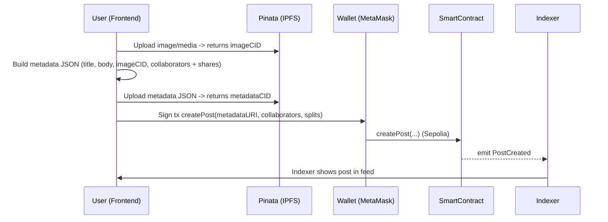
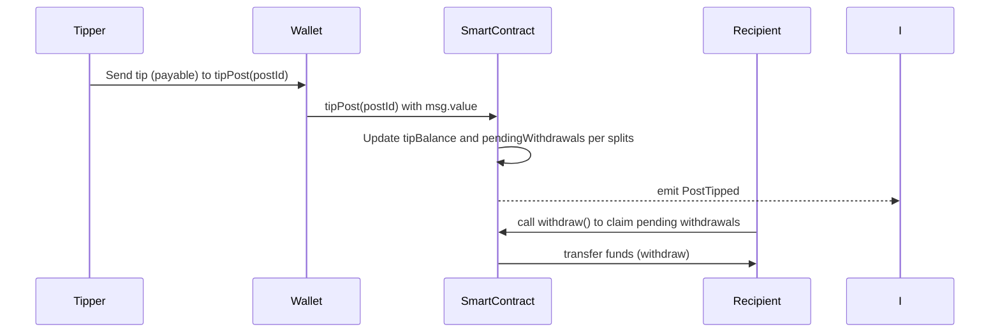

```markdown
# feedScroll — Blockchain Module (Hardhat + Sepolia)

About the project (English)
feedScroll is a creator-first micro-posting dApp that lets users publish short posts with media, collaborate on content creation, and receive direct financial support from the community. Each post can have multiple collaborators (for example: image creator, content writer, editor) and revenue from tips and boosts is split automatically according to the shares defined when the post is created. Media and post metadata are stored on IPFS via Pinata, while the revenue logic and on‑chain actions (create, tip, like, comment, boost, distribute) are handled by smart contracts. Hardhat is used for local development and Sepolia for testnet deployments.

Project explanation (Hindi / हिन्दी)
feedScroll ek creator-centric micro-posting platform hai jahan users chhote post, tasveer aur metadata upload karte hain (Pinata IPFS par). Har post multiple collaborators rakh sakti hai — jaise image creator, content writer aur editor — aur jab post par log tip ya boost bhejte hain to paisa un collaborators mein unke defined shares ke hisaab se baanta jaata hai. Smart contracts on-chain logic ko sambhalte hain (post create karna, tip/boost bhejna, like/comment record karna, aur funds ka distribution). Hardhat local development aur testing ke liye use hota hai; Sepolia testnet par public testing aur verification ke liye deploy karte hain.

---

Table of contents
- Overview & Features
- Technical architecture
- Data model
- Smart contract API & business logic
- End-to-end workflow (diagrams)
- Pinata / IPFS integration
- Setup, test & deploy (Hardhat + Sepolia)
- Environment (.env) template
- Security, testing & best practices
- Gas & UX optimizations
- Future improvements
- License

---

Overview & Features
- Create a post referencing IPFS-hosted media and metadata.
- Support multiple collaborators per post with configurable revenue splits.
- Tip a post (payable) and boost a post (payable) to increase visibility.
- Like and comment features recorded on-chain as events/state.
- Funds from tips/boosts are split between collaborators according to configurable splits at the time of post creation.
- Pull-over-push withdrawals (pending withdrawals) recommended for safety.
- Media & metadata stored on IPFS via Pinata.
- Hardhat for development; Sepolia for testnet.

Quick Hardhat commands (from sample project)
```shell
npx hardhat help
npx hardhat test
REPORT_GAS=true npx hardhat test
npx hardhat node
npx hardhat ignition deploy ./ignition/modules/Lock.js
```

---

Technical architecture (high-level)

```mermaid
graph LR
  UserFrontend[Frontend (React / Next.js)]
  Pinata[Pinata / IPFS]
  Wallet[User Wallet (MetaMask / WalletConnect)]
  Contract[Smart Contract(s) on Sepolia]
  Hardhat[Hardhat (dev + deploy)]
  Indexer[Backend Indexer / TheGraph]
  Collaborators[Collaborator Wallets]

  UserFrontend -->|upload media| Pinata
  Pinata -->|CID/metadataURI| UserFrontend
  UserFrontend -->|tx (ethers.js)| Wallet
  Wallet -->|call contract| Contract
  Contract -->|emit events| Indexer
  Indexer -->|serve feed| UserFrontend
  Contract -->|pendingWithdrawals/distribute| Collaborators
  Hardhat -->|deploy/tests| Contract
```

Components
- Smart Contracts (Solidity)
  - PostManager: createPost, tipPost, likePost, commentPost, boostPost, distributeFunds, withdraw.
  - Optional helper contracts: PaymentSplitter, ERC20 adapters (if enabling token tipping).
- Frontend: Uploads to Pinata, constructs metadata JSON, calls contract through ethers.js + MetaMask.
- Pinata/IPFS: Stores media & metadata; returns CIDs used on-chain.
- Indexer/Subgraph: Listens to events and builds feed for fast queries.
- Hardhat: compile, test, local node, deployment scripts.

---

On-chain data model (representative)
Post struct (example):
- uint256 id
- address author
- string metadataURI         // ipfs://<CID>
- address[] collaborators
- uint16[] splits            // basis points (e.g., parts-per-10000)
- uint256 tipBalance
- uint256 boostBalance
- uint256 likesCount
- uint256 commentsCount
- uint256 createdAt
- bool distributed

Mappings & state:
- mapping(uint256 => Post) public posts;
- mapping(uint256 => mapping(address => bool)) public hasLiked;
- mapping(address => uint256) public pendingWithdrawals;
- mapping(uint256 => Comment[]) comments; (or events-only comments)

Events:
- event PostCreated(uint256 indexed postId, address indexed author, string metadataURI);
- event PostTipped(uint256 indexed postId, address indexed tipper, uint256 amount);
- event PostBoosted(uint256 indexed postId, address indexed booster, uint256 amount);
- event PostLiked(uint256 indexed postId, address indexed liker);
- event PostCommented(uint256 indexed postId, address indexed commenter, string commentCID);
- event FundsDistributed(uint256 indexed postId, address[] recipients, uint256[] amounts);

Splits precision:
- Use a fixed denominator (e.g., 10,000) to represent shares as integers.
- Validate sum(splits) == DENOMINATOR on create.

---

Smart contract functions & logic (conceptual)

- createPost(string calldata metadataURI, address[] calldata collaborators, uint16[] calldata splits)
  - Require collaborators.length == splits.length && sum(splits) == DENOMINATOR.
  - Store post and emit PostCreated.

- tipPost(uint256 postId) external payable
  - Require msg.value > 0.
  - Update post.tipBalance and/or pendingWithdrawals for collaborators per split (pull pattern).
  - Emit PostTipped.

- boostPost(uint256 postId) external payable
  - Similar to tip; add to boostBalance and emit PostBoosted.
  - Off-chain indexer may use boost amounts to increase visibility.

- likePost(uint256 postId)
  - Ensure single-like per user (prevent duplicate likes) and increment likesCount.
  - Emit PostLiked.

- commentPost(uint256 postId, string calldata commentCID)
  - Emit PostCommented; store comment count or minimal on-chain reference.

- distributeFunds(uint256 postId)
  - Compute recipients' shares from tipBalance + boostBalance.
  - Either push payments (transfer) or increase pendingWithdrawals[recipient] (recommended).
  - Emit FundsDistributed.

- withdraw()
  - Allow a recipient to withdraw their pending balance (using checks-effects-interactions and ReentrancyGuard).

Payment design note
- Prefer pull payments: update pendingWithdrawals and let recipients withdraw. This avoids reentrancy and gas issues when splitting to multiple recipients in a single tx.
- If immediate transfers are needed, use OpenZeppelin's Address.sendValue and guard with ReentrancyGuard, but beware of failing transfers.

---

Workflow diagrams (end-to-end)

Create post workflow:


Tip & distribution workflow:


---

Pinata / IPFS integration

Metadata JSON schema example (store this on IPFS via Pinata):
{
  "title": "My new post",
  "description": "Short content or excerpt",
  "image": "ipfs://QmImageCid...",
  "createdAt": 1700000000,
  "collaborators": [
    {"address":"0xAbc...","role":"image","share":6000},
    {"address":"0xDef...","role":"writer","share":2500},
    {"address":"0xGhi...","role":"editor","share":1500}
  ],
  "extra": {}
}

Integration notes:
- Use Pinata SDK or REST API to pin files and JSON.
- Keep Pinata API keys secret — upload via backend or serverless function, or use short-lived JWTs for client uploads.
- Save ipfs://<CID> (or https gateway link) in metadataURI on-chain.
- For comments, you can store comment text on IPFS and include the commentCID in PostCommented event.

Pinata upload example (conceptual):
- Upload image -> get imageCID
- Create metadata JSON pointing to ipfs://imageCID -> pin metadata -> get metadataCID
- Call createPost("ipfs://metadataCID", collaborators, splits) from frontend

---

Setup & run (development)

Prereqs:
- Node.js >= 16
- npm or yarn
- Hardhat (dev dependency)
- MetaMask or other wallet for Sepolia
- Sepolia RPC provider key (Alchemy/Infura) and a funded account for deploys

Install:
```bash
# from Blockchain folder
npm install
# or
yarn install
```

Common Hardhat commands:
- Compile:
  npx hardhat compile

- Run local node:
  npx hardhat node

- Run tests:
  npx hardhat test
  REPORT_GAS=true npx hardhat test

- Deploy to Sepolia (example script):
  npx hardhat run --network sepolia scripts/deploy.js

- Verify on Etherscan:
  npx hardhat verify --network sepolia <DEPLOYED_ADDRESS> "<constructor_arg1>" ...

Original sample:
- npx hardhat ignition deploy ./ignition/modules/Lock.js

---

.env template (example)
Create a .env file in Blockchain folder (do NOT commit):

SEPOLIA_RPC_URL="https://eth-sepolia.alchemyapi.io/v2/YOUR_KEY"
DEPLOYER_PRIVATE_KEY="0x..."
PINATA_API_KEY="..."
PINATA_SECRET_API_KEY="..."
PINATA_JWT="..." # optional for client uploads
ETHERSCAN_API_KEY="..."

---

Testing & CI suggestions
- Unit tests:
  - Post creation with valid/invalid splits.
  - Tip flows, pendingWithdrawals updates, rounding behavior.
  - Withdraw flows and reentrancy protection.
  - Like and comment prevention (double-like).
  - Boost-related ranking logic (if any on-chain).
- Use gas reporter in tests:
  REPORT_GAS=true npx hardhat test
- Run static analysis (solhint) and optional Slither for vulnerability detection in CI.

---

Security considerations & best practices
- Prefer pull-over-push payments: update pendingWithdrawals and let recipients withdraw.
- Use ReentrancyGuard, Ownable (OpenZeppelin).
- Validate array lengths and sum(splits) == DENOMINATOR.
- Avoid unbounded on-chain loops; limit collaborators per post or handle distribution off-chain.
- Use events for all actions for reliable off-chain indexing.
- Never store private keys or PINATA secrets in public repo.

Edge cases & rounding
- Use integer math and a fixed denominator (e.g., 10000). On rounding remainders, assign residual wei to the author or to contract owner reserve to avoid lost funds.

Gas & UX optimizations
- Store only metadataURI on-chain, not full content.
- Limit number of collaborators per post (e.g., <= 5) to keep distribution gas feasible.
- Consider batching withdrawals or letting recipients pull individually.
- Consider ERC20 tipping for lower volatility or separate tokens for easier accounting.

Future improvements
- Add a subgraph (TheGraph) for richer queries and ranking.
- Support ERC20 tipping and meta-transactions (gasless UX).
- Off-chain dispute resolution & moderation flows.
- Integrate royalty / licensing metadata for collaborators.
- Improve UX for collaborative post creation (on-chain signed collaborator approvals).

Credits & acknowledgments
- Built with Hardhat, Ethers.js, OpenZeppelin, Pinata (IPFS).

License
- Add a LICENSE file at project root (e.g., MIT).

---

Appendix: Example metadata & small notes

Example post metadata (JSON)
{
  "title": "Sunset Sketch",
  "description": "A short caption + collaborator credits",
  "image": "ipfs://QmImageCid...",
  "createdAt": 1700000000,
  "collaborators": [
    {"address":"0xAbc...","role":"image","share":6000},
    {"address":"0xDef...","role":"writer","share":3000},
    {"address":"0xGhi...","role":"editor","share":1000}
  ]
}

Minimal suggestions for contract implementers
- Use solidity ^0.8.x (built-in overflow checks).
- Use OpenZeppelin's Ownable and ReentrancyGuard.
- Consider PaymentSplitter for simple use-cases but adapt to store per-post splits.
- Keep metadata off-chain to save gas and use events for indexing.

---

If you want, I can:
- Commit this README to the Blockchain folder and open a PR for you, or
- Generate a sample Solidity interface / skeleton for PostManager.sol, or
- Create a Pinata upload script (Node.js) and a small frontend example (ethers.js) that demonstrates createPost → tipPost → withdraw flows.
```
